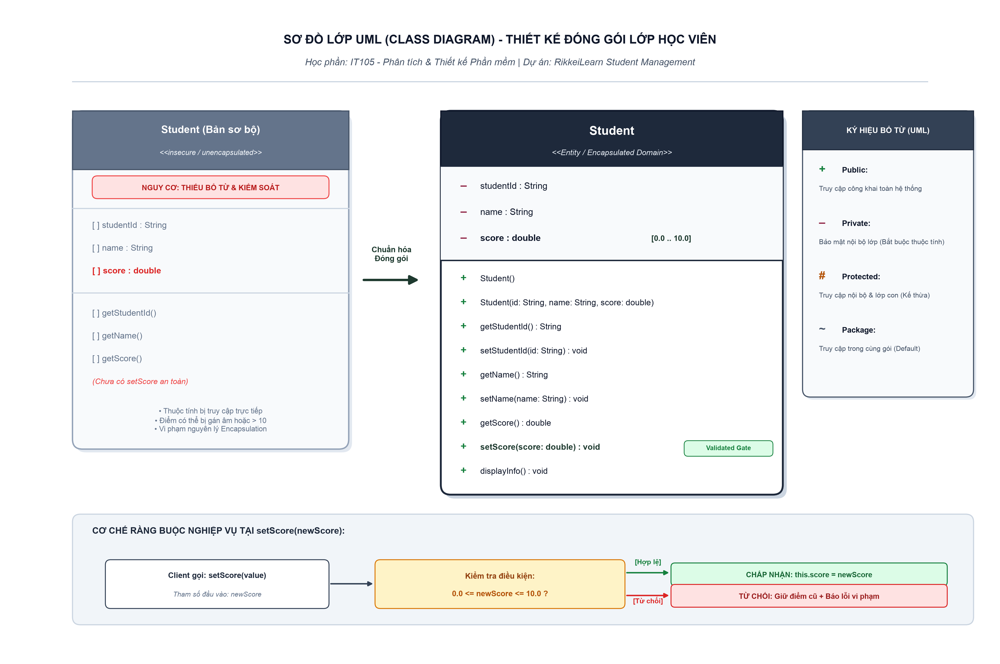

# THIẾT KẾ ĐÓNG GÓI LỚP HỌC VIÊN (STUDENT) - HỆ THỐNG RIKKEILEARN

**Học phần:** IT105 - Phân tích & Thiết kế Phần mềm  
**Bài tập:** Session 07 - Bài 1  
**Sinh viên thực hiện:** Nguyễn Tuấn Khang (tuankhn / cactor7733789)

---

## 1. Bản vẽ Sơ đồ lớp UML (Class Diagram)

Dưới đây là sơ đồ lớp hoàn chỉnh chuẩn UML 2.5 áp dụng nguyên lý đóng gói (Encapsulation) để bảo vệ toàn vẹn dữ liệu hồ sơ học viên:



> **File thiết kế nguồn (Draw.io):** [class_diagram.drawio](class_diagram.drawio) (có thể mở và chỉnh sửa trực tiếp trên draw.io hoặc VS Code).

---

## 2. Phần 1 — Chuẩn hóa Sơ đồ & Bổ từ truy cập (Access Modifiers)

### 2.1. Quy ước ký hiệu chuẩn UML
| Ký hiệu | Bổ từ (Modifier) | Phạm vi truy cập (Scope) | Áp dụng trong lớp Student |
| :---: | :--- | :--- | :--- |
| **`-`** | **Private** | Chỉ nội bộ bên trong lớp `Student` | Áp dụng cho 100% thuộc tính (`studentId`, `name`, `score`) |
| **`+`** | **Public** | Truy cập công khai từ mọi nơi trong hệ thống | Áp dụng cho Constructor và toàn bộ các hàm Getter/Setter |
| **`#`** | **Protected** | Nội bộ lớp và các lớp con kế thừa | Dự phòng khi mở rộng kế thừa các đối tượng học viên đặc thù |
| **`~`** | **Package-Private** | Chỉ truy cập trong phạm vi cùng package | Mặc định (không khuyến nghị dùng cho dữ liệu nhạy cảm) |

### 2.2. Chi tiết cấu trúc Lớp `Student` sau khi đóng gói
- **Thuộc tính (Attributes - Private `-`):**
  - `- studentId: String`: Mã định danh học viên (ngăn chặn sửa đổi tùy tiện từ bên ngoài).
  - `- name: String`: Họ và tên học viên.
  - `- score: double`: Điểm trung bình tích lũy (ràng buộc nghiêm ngặt trong dải `[0.0 .. 10.0]`).
- **Phương thức (Methods - Public `+`):**
  - `+ Student()`: Constructor không tham số mặc định.
  - `+ Student(studentId: String, name: String, score: double)`: Constructor đầy đủ tham số (tái sử dụng `setScore()` để kiểm tra dữ liệu).
  - `+ getStudentId(): String` / `+ setStudentId(studentId: String): void`: Cung cấp quyền đọc và cập nhật mã học viên.
  - `+ getName(): String` / `+ setName(name: String): void`: Cung cấp quyền đọc và cập nhật tên học viên.
  - `+ getScore(): double`: Cung cấp quyền đọc điểm trung bình tích lũy.
  - `+ setScore(score: double): void`: Cổng kiểm duyệt dữ liệu (Validation Gate).
  - `+ displayInfo(): void`: Xuất toàn bộ thông tin hồ sơ học viên.

---

## 3. Phần 2 — Mô tả Logic an toàn & Mã giả (Pseudocode)

### 3.1. Logic kiểm soát của phương thức `setScore()`
Phương thức `setScore(newScore)` đóng vai trò là "người gác cổng" (Gatekeeper). Điểm số trung bình chỉ được phép cập nhật nếu thỏa mãn điều kiện canh gác:
$$\text{newScore} \ge 0.0 \quad \text{AND} \quad \text{newScore} \le 10.0$$

Nếu vi phạm (điểm âm hoặc lớn hơn 10): Hệ thống từ chối cập nhật, giữ nguyên giá trị điểm hiện tại và thông báo lỗi.

### 3.2. Mã giả (Pseudocode)
```text
METHOD setScore(newScore: Real) -> Boolean:
    // Bước 1: Kiểm tra điều kiện canh gác (Guard Condition)
    IF newScore >= 0.0 AND newScore <= 10.0 THEN
        // Bước 2a: Hợp lệ -> Gán giá trị vào thuộc tính private
        this.score = newScore
        OUTPUT "Cập nhật điểm thành công: " + newScore
        RETURN True
    ELSE
        // Bước 2b: Vi phạm bẫy dữ liệu -> Từ chối cập nhật & báo lỗi
        OUTPUT "Lỗi: Điểm số " + newScore + " không hợp lệ! Điểm phải nằm trong dải [0, 10]."
        RETURN False // Giữ nguyên giá trị điểm số cũ
    END IF
END METHOD
```

---

## 4. Ma trận kiểm thử Bẫy dữ liệu (Edge Cases Matrix)

| STT | Phân loại ca kiểm thử | Giá trị đầu vào (`newScore`) | Kết quả kỳ vọng | Trạng thái thuộc tính `score` |
| :-: | :--- | :---: | :--- | :--- |
| 1 | Điểm hợp lệ thông thường | `8.5` | Chấp nhận cập nhật | `score = 8.5` |
| 2 | Cận biên dưới hợp lệ (Min) | `0.0` | Chấp nhận cập nhật | `score = 0.0` |
| 3 | Cận biên trên hợp lệ (Max) | `10.0` | Chấp nhận cập nhật | `score = 10.0` |
| 4 | **Bẫy điểm âm cận biên** | `-0.1` | **Từ chối cập nhật** (Báo lỗi) | Giữ nguyên điểm cũ |
| 5 | **Bẫy điểm âm sâu** | `-5.0` | **Từ chối cập nhật** (Báo lỗi) | Giữ nguyên điểm cũ |
| 6 | **Bẫy điểm vượt trần cận biên** | `10.1` | **Từ chối cập nhật** (Báo lỗi) | Giữ nguyên điểm cũ |
| 7 | **Bẫy điểm vượt trần cao** | `15.0` | **Từ chối cập nhật** (Báo lỗi) | Giữ nguyên điểm cũ |
| 8 | **Bẫy giá trị cực đoan** | `-999.0` / `999.0` | **Từ chối cập nhật** (Báo lỗi) | Giữ nguyên điểm cũ |

---

## 5. Tài liệu nộp kèm
- **File Báo cáo Word:** [BaoCao_ThietKe_DongGoi_Lop_HocVien.docx](BaoCao_ThietKe_DongGoi_Lop_HocVien.docx)
- **File bản vẽ thiết kế:** [class_diagram.drawio](class_diagram.drawio)
- **Ảnh sơ đồ lớp:** [class_diagram.png](class_diagram.png)
